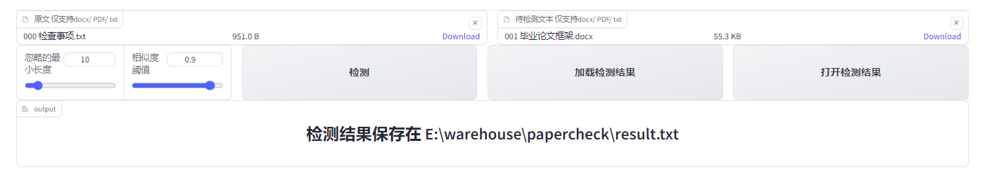

[//]: # (Name: readme.md)
[//]: # (Title: README.md)  
[//]: # (Author: [子永](子永))

# 论文查重

## 项目目的
  
主要是查重自己的师兄师姐的论文
## 当前页面




## 安装

```
pip install -r requirements.txt
```

## 使用
### 修改文件路径

```python 
# 修改为自己的文件路径，origin_file_path为原文，checked_file_path为待检测的文本
origin_file_path = r"E:\tmp\checked.docx"
checked_file_path = r"E:\tmp\origin.docx"
```

- 使用IDE或者命令行运行main.py
```
python main.py
```

## 项目进度
[x] 初步完成检测框架
目前可以输出语句的相似度，通过自己调节阈值来判断是否为抄袭
[x] 添加web操作页面，可以通过浏览器进行操作选择文件，支持docx和pdf格式和txt格式

